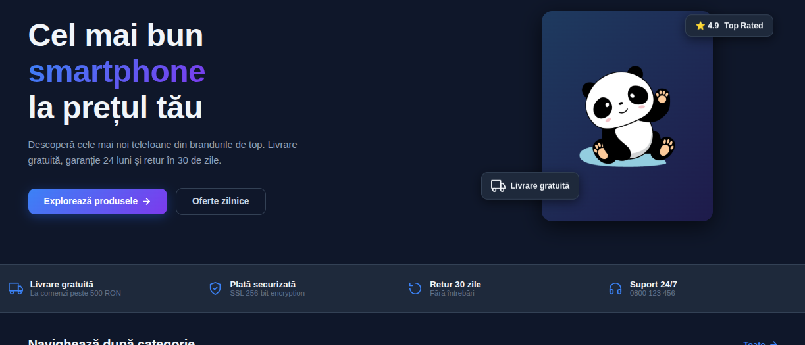
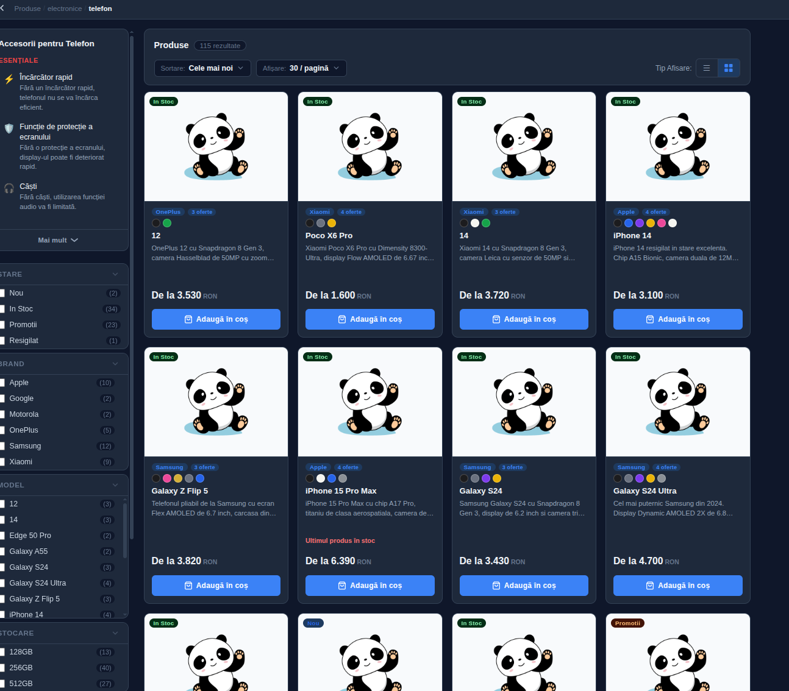
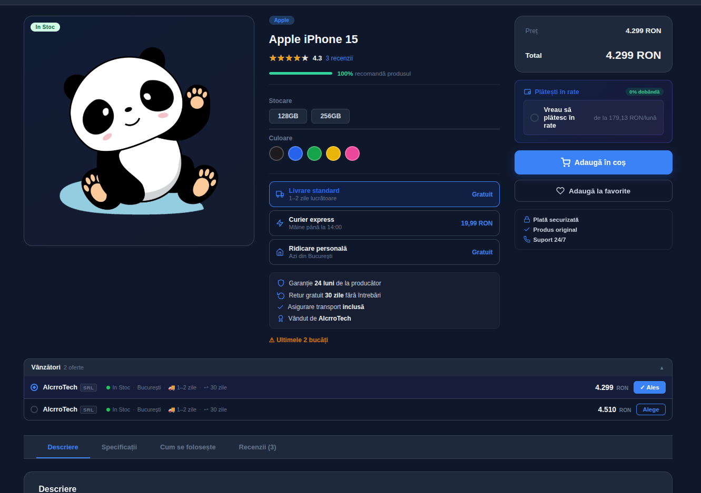
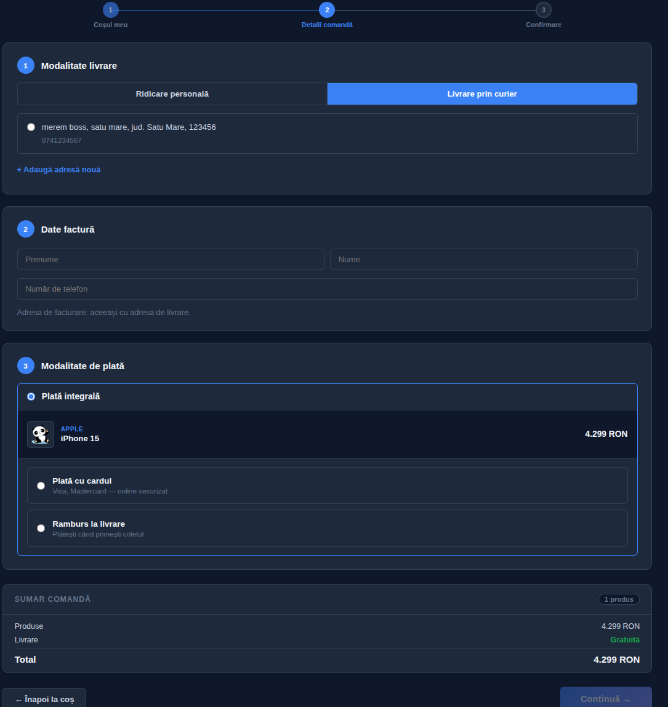
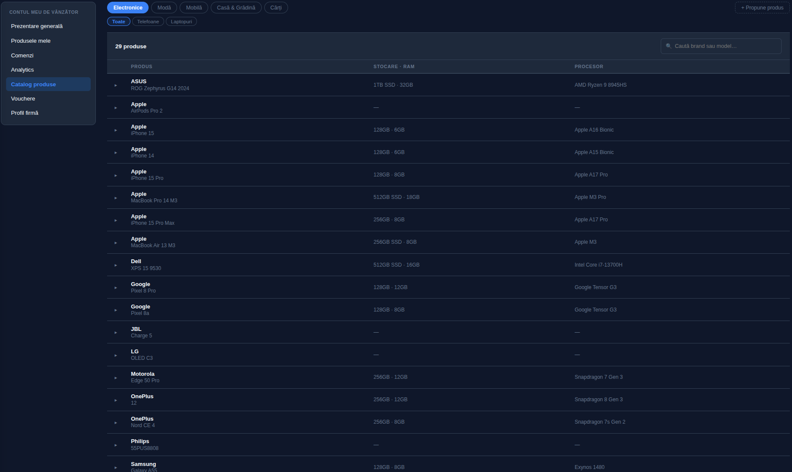
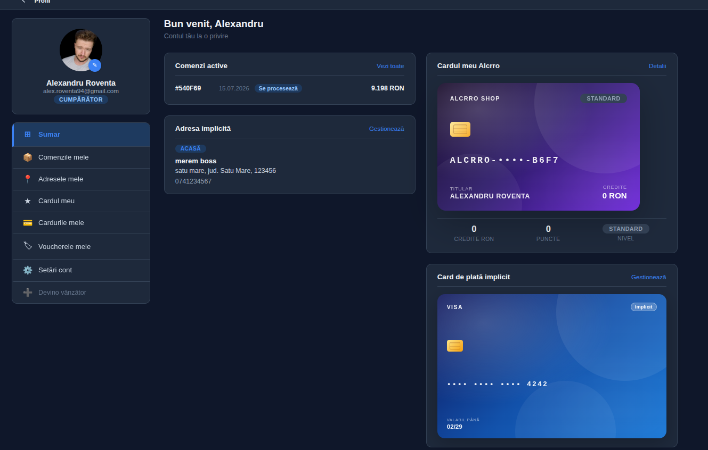
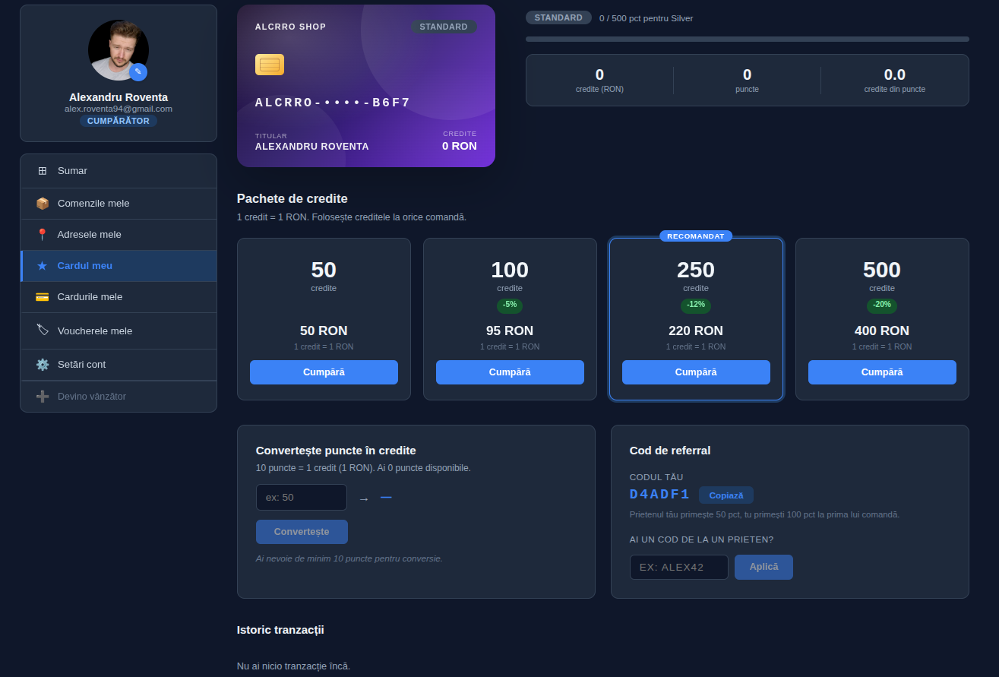

# alcrro — Multi-Vendor E-commerce Platform

**Live demo:** [alcrro-shop.vercel.app](https://alcrro-shop.vercel.app)  
**API:** [alcrro.onrender.com](https://alcrro.onrender.com)

> Backend runs on Render free tier — first request may take ~30s to cold-start.

Full-stack MERN marketplace with multi-vendor support, real Stripe payments, a loyalty card system, vendor-issued vouchers, and role-based dashboards for Admin / Vendor / Client.

---

## Screenshots

| | |
|---|---|
|  |  |
| Homepage | Product catalog with filters |
|  |  |
| Product page with seller picker | Stripe checkout |
|  |  |
| Vendor dashboard | User profile & AlcrroCard |



---

## Features

### Payments & Checkout
- **Stripe PaymentIntents** — card payments with saved methods, CVV-only re-auth for returning buyers
- **Installment plans** — BCR / BT / ING rate calculator with monthly breakdown
- **Voucher discounts** — vendor-issued promo codes + automatic reward vouchers after delivery
- **AlcrroCard loyalty** — points earned per order, 4 tiers (Bronze → Platinum), credits redeemable at checkout
- **3-step checkout** — cart → address/payment → confirm, with rollback on payment failure

### Catalog & Products
- **Multi-vendor listings** — multiple vendors per canonical product, buyer compares price/stock/delivery
- **8+ simultaneous filters** — brand, model, RAM, storage, color, price range, availability, rating — URL-persistent
- **Product variants** — Mongoose discriminator pattern; color/storage/RAM per listing
- **SEO-friendly URLs** — slug-based routes with canonical meta tags

### Vendor
- **Apply → Approve flow** — vendors apply, admin reviews; protected dashboard unlocked on approval
- **Dashboard (6 sections)** — products, orders, voucher rules, business profile, revenue overview
- **Automatic reward vouchers** — vendor sets a rule; system emits vouchers to buyers post-delivery
- **Cloudinary image upload** — drag-drop with crop, stored per vendor listing

### User
- **Role hierarchy** — Admin / Vendor / Client with dedicated UIs and protected routes
- **Saved payment methods** — Stripe Customer + PaymentMethod; default card with CVV-only flow
- **Avatar upload** — circular crop, Cloudinary storage
- **Order timeline** — Pending → Processing → Shipped → Delivered with inline pay for unpaid orders
- **Dark mode** — CSS custom properties, persisted in localStorage

---

## Tech Stack

| Layer | Technology |
|-------|-----------|
| Frontend | React 18, Redux Toolkit, RTK Query, React Router v6 |
| Styling | Plain CSS + CSS custom properties (no Tailwind) |
| Backend | Node.js 18, Express 4, express-async-handler |
| Database | MongoDB / Mongoose 6 (discriminator pattern) |
| Auth | JWT in httpOnly cookie (`Secure; SameSite=None` in production) |
| Payments | Stripe v22 (PaymentIntents, Customers, Webhooks) |
| Images | Cloudinary (vendor products + user avatars) |
| Email | Resend (newsletter, transactional) |
| Hosting | Vercel (frontend) + Render (backend) |

---

## Architecture

```
frontend/src/
  Components/
    atoms/          # Button, Input, Badge — max 50 lines
    molecules/      # SearchBar, FilterChip, SummaryWidget — max 80 lines
    organisms/      # Header, ProductCard, OrderDetailPanel — max 150 lines
  Pages/            # Route composition only, zero business logic — max 60 lines
  features/         # RTK Query endpoints + Redux slices (one file per resource)
  hooks/            # Shared custom hooks
  utils/            # Pure functions: formatters, validators, constants

backend/
  controllers/      # One file per resource
  models/           # Mongoose schemas + discriminators
  routes/           # Express routers
  middleware/       # protect (JWT), authorize (role), errorHandler
```

**State management rules:**
- RTK Query — all server state (products, orders, vendor ops)
- Redux slices — global UI state (cart, auth, filters, theme)
- useState — component-local only (open/closed, input before submit)

---

## Setup

### Prerequisites
- Node.js ≥ 18
- MongoDB Atlas cluster
- Stripe account (test keys work)
- Cloudinary account

### 1. Clone and install

```bash
git clone https://github.com/Alcrro/alcrro-shop.git
cd alcrro-shop
npm install
npm install --prefix frontend
```

### 2. Environment variables

Copy `.env.example` → `.env` in the project root and fill in the values.  
Copy `frontend/.env.example` → `frontend/.env` and set `REACT_APP_API_URL` (leave empty for local dev — CRA proxy handles it).

### 3. Run in development

```bash
npm run dev
```

Frontend → http://localhost:3000  
Backend API → http://localhost:5000/api

---

## Demo Credentials

| Role | Email | Password |
|------|-------|----------|
| Admin | admin@alcrro.ro | Parola123 |
| Vendor | vendor@alcrro.ro | Parola123 |
| Client | ion@gmail.com | Parola123 |

Stripe test card: `4242 4242 4242 4242` · any future expiry · any CVC

---

## Feature Deep-Dives

| Feature | What's interesting |
|---------|-------------------|
| [Stripe Payments](docs/features/stripe-payments/README.md) | PaymentIntent lifecycle, cancelled PI recovery, saved card CVV-only flow |
| [Voucher System](docs/features/voucher/README.md) | Vendor rules engine, server-side discount validation, reward emission post-delivery |
| [AlcrroCard](docs/features/alcrro-shop-card/README.md) | Points + tier multipliers, credits redeemable at checkout, referral codes |
| [Multi-Vendor](docs/features/vendor-dashboard/README.md) | Apply/approve flow, seller picker, vendor-scoped order management |
| [Checkout](docs/features/checkout-payment/README.md) | 3-step wizard, installment calculator, voucher + credits stacking |
| [Product Catalog](docs/features/product-catalog/README.md) | Discriminator pattern, 8-filter URL state, multi-vendor seller comparison |
| [Profile](docs/features/profile-summary/README.md) | Saved cards, avatar crop/upload, order timeline with inline payment |

---

## API Overview

| Method | Route | Auth | Description |
|--------|-------|------|-------------|
| POST | `/api/auth/register` | — | Register, returns JWT cookie |
| POST | `/api/auth/login` | — | Login, sets httpOnly cookie |
| GET | `/api/products` | optional | Products with filter/sort/pagination |
| GET | `/api/products/:id/sellers` | — | All vendor listings for a product |
| POST | `/api/orders` | Client | Create order, deducts stock atomically |
| POST | `/api/orders/:id/confirm-payment` | Client | Sync order after Stripe PI succeeds |
| GET | `/api/shop-card/my` | Client | AlcrroCard with points + tier |
| POST | `/api/vouchers/validate` | Client | Validate + preview voucher discount |
| GET | `/api/vendor/me` | Vendor | Vendor profile |
| GET | `/api/admin/vendors` | Admin | All vendors pending/approved |

---

## Scripts

```bash
npm run dev           # Backend + frontend (concurrently)
npm run server        # Backend only (nodemon)
npm run client        # Frontend only
npm run seed          # Seed demo data
npm run test:backend  # Backend unit tests
```

---

## Project History

**2023 — Initial build:** Auth, product catalog, shopping cart, checkout, orders, user profile, admin panel.

**2026 — Full rewrite:**
- Atomic design component architecture (atoms → molecules → organisms → pages)
- RTK Query replacing Redux Thunk for all server state
- Stripe PaymentIntents with saved cards, webhooks, installment plans
- Multi-vendor marketplace: apply/approve, vendor dashboard (6 sections), seller comparison
- Voucher system: vendor rules, reward emission, server-side validation
- AlcrroCard loyalty: points, tiers, credits, referral
- Complete CSS rewrite with custom properties, BEM naming, dark mode
- JWT cookie with `Secure; SameSite=None` for cross-origin production deployment
